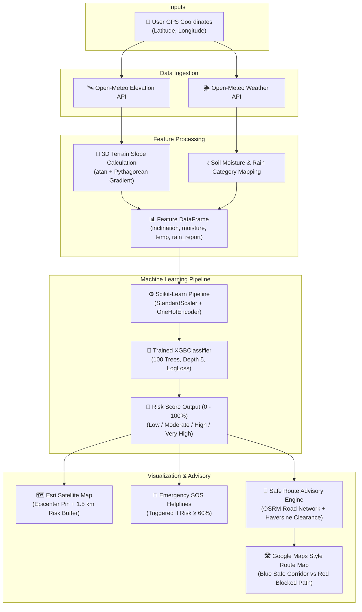

# ⛰️ BhuAlert — AI-Powered Landslide Early Warning & Safe Route Advisory System

<p align="center">
  
</p>

<p align="center">
  <strong>Smart India Hackathon (SIH 2026) Prototype</strong><br>
  <em>Real-time geomorphological landslide hazard forecasting and dynamic threat-avoiding navigation.</em>
</p>

<p align="center">
  
  
  
  
  
</p>

---

## 📌 Problem Statement & Motivation

Mountainous regions across Northeast India and Himalayan corridors experience devastating rainfall-triggered slope failures every monsoon season. Traditional disaster management often suffers from:
- **Delayed Warning Dissemination**: Communities receive alerts only after significant ground movement has occurred.
- **Stranded Commuters & Supply Chains**: Landslides block arterial national highways, isolating remote villages and cutting off medical logistics.
- **Resource-Heavy GIS Requirements**: Traditional systems require massive multi-gigabyte DEM rasters and offline spatial workstations that cannot operate rapidly on the edge.

**BhuAlert** provides a lightweight, real-time, browser-accessible disaster intelligence platform combining **on-demand terrain analysis**, **live meteorological forecasting**, **XGBoost machine learning**, and **Google Maps-styled safe route navigation**.

---

## 🚀 Key Features

- 🛰️ **On-Demand 3D Terrain Slope Estimation**:
  - Samples a triangular GPS elevation matrix via the **Open-Meteo Elevation API**.
  - Calculates true trigonometric slope incline ($	ext{degrees}$) in real-time without storing gigabytes of offline topographic rasters.
- 🌧️ **Live Environmental Ingestion**:
  - Live query to the **Open-Meteo Weather Forecast API**.
  - Captures precipitation rate ($	ext{mm/hr}$), categorical classification (`clear`, `light_rain`, `rain`, `continuous_rain`, `downpour`), temperature, and root-zone soil moisture ($3	ext{--}9	ext{ cm depth}$ as a percentage).
- 🧠 **Trained & Cached XGBoost Classification Pipeline**:
  - Preprocesses continuous variables (`StandardScaler`) and categorical triggers (`OneHotEncoder`).
  - Powered by gradient boosted decision trees (`XGBClassifier`) trained on regional Northeast India landslide datasets.
  - Cached via `@st.cache_resource` for instantaneous prediction and zero re-training delay.
- 🗺️ **Dual Geospatial Visualization**:
  - **Satellite Hazard View**: High-resolution Esri world imagery centered on the analyzed GPS coordinates with a 1.5 km translucent risk perimeter and color-coded alert pins.
  - **Google Maps Navigation View**: Clean roadmap styling with authentic visual markers.
- 🧭 **Intelligent Safe Route Advisory**:
  - Evaluates real drivable road networks using the **Open Source Routing Machine (OSRM)**.
  - Checks road proximity against active landslide hazard epicenters using the **Haversine Geodesic Distance**.
  - Automatically identifies bypass corridors around danger zones when a direct road is compromised.
  - Provides side-by-side metric comparisons: Distance ($\Delta 	ext{km}$ detour), Travel Time ($\Delta 	ext{min}$), and Hazard Clearance.
- 🚨 **Automated Emergency Protocol**:
  - Automatically triggers priority emergency helpline cards (`112` National Emergency, `108` Ambulance, `101` Fire & Rescue) whenever assessed risk is categorized as High or Very High ($\ge 60\%$).

---

## 🏗️ System Architecture



---

## 🛠️ Technology Stack

| Layer | Technology | Purpose |
|---|---|---|
| **Frontend UI** | Streamlit, HTML5, Vanilla CSS | Rapid, responsive web dashboard with KPI metrics and controls |
| **Mapping & GIS** | Folium, Streamlit-Folium, Leaflet.js | Interactive mapping with custom tile layers, SVG pins, and GeoJSON lines |
| **Map Tile Providers** | Google Maps Roadmap, Esri World Imagery | High-fidelity satellite imagery and authentic Google Maps road layout |
| **Routing Engine** | OSRM (Open Source Routing Machine) | Turn-by-turn road network calculation with zero API key dependencies |
| **Machine Learning** | XGBoost (`XGBClassifier`), Scikit-Learn | Supervised gradient boosted decision tree classifier |
| **Data Processing** | Pandas, NumPy | Feature matrix construction, tabular ingestion, and unit conversions |
| **External APIs** | Open-Meteo Elevation & Weather Forecast APIs | Live terrain elevation sampling, live hourly rain, and soil moisture |

---

## 📂 Project Structure

```text
SIH2026/
│
├── app.py                      # Main Streamlit application (ML model, UI, GIS, routing)
├── requirements.txt            # Python library dependencies
├── README.md                   # Comprehensive project documentation
│
├── Datasets/
│   ├── Northeast_India_ML_Simulated_Triggers.csv   # Primary training dataset (NER conditions)
│   ├── Northeast_India_Landslide_Data.csv          # Historical regional landslide incidence
│   ├── datafile.csv                                # Raw reference geodata
│   └── landslide_model.pkl                         # Serialized baseline model artifact
│
├── assets/
│   └── Icons/                                      # UI brand icons and graphic elements
│
└── SIH.venv/                                       # Python virtual environment (optional)
```

---

## ⚙️ Installation & Quickstart

### 1. Prerequisites
- **Python 3.10** or higher.
- Stable internet connection (for live Open-Meteo weather & OSRM routing calls).

### 2. Clone or Open Project Directory
```bash
cd C:\Users\subho\Desktop\SIH2026
```

### 3. Create & Activate Virtual Environment
**On Windows (PowerShell):**
```powershell
python -m venv SIH.venv
.\SIH.venv\Scripts\Activate.ps1
```

**On Windows (Command Prompt):**
```cmd
python -m venv SIH.venv
.\SIH.venv\Scripts\activate.bat
```

### 4. Install Required Packages
```bash
pip install -r requirements.txt
```

### 5. Launch the Streamlit App
```bash
streamlit run app.py
```
Open your browser at `http://localhost:8501`.

---

## 🧪 Mathematical & Algorithmic Formulations

### 1. 3D Terrain Slope Estimation
Elevation is queried at 3 spatial points: Center $(lat, lon)$, North $(lat + \Delta, lon)$, and East $(lat, lon + \Delta)$, where $\Delta = 0.001^\circ pprox 111.32	ext{ m}$:
$$\Delta y = \Delta 	imes 111320 \quad (	ext{meters North})$$
$$\Delta x = \Delta 	imes 111320 	imes \cos\left(rac{lat \cdot \pi}{180}
ight) \quad (	ext{meters East})$$
$$	ext{Rise}_N = rac{	ext{Elev}_{	ext{North}} - 	ext{Elev}_{	ext{Center}}}{\Delta y}, \quad 	ext{Rise}_E = rac{	ext{Elev}_{	ext{East}} - 	ext{Elev}_{	ext{Center}}}{\Delta x}$$
$$	ext{Slope Angle} = rctan\left(\sqrt{	ext{Rise}_N^2 + 	ext{Rise}_E^2}
ight) 	imes rac{180}{\pi}$$

---

### 2. Geodesic Proximity Check (Haversine Formula)
To confirm whether a point along a driving route $(p_{	ext{lat}}, p_{	ext{lon}})$ is safely clear of the active hazard center $(h_{	ext{lat}}, h_{	ext{lon}})$:
$$a = \sin^2\left(rac{\Delta 	ext{lat}}{2}
ight) + \cos(p_{	ext{lat}})\cos(h_{	ext{lat}})\sin^2\left(rac{\Delta 	ext{lon}}{2}
ight)$$
$$d = 2 R \cdot rctan2\left(\sqrt{a}, \sqrt{1 - a}
ight) \quad (	ext{Earth Radius } R = 6371	ext{ km})$$
If $\min(d) < R_{	ext{danger}}$, the direct road is flagged as hazardous.

---

### 3. Dynamic Hazard Bypass Routing
When a direct road is compromised:
1. Calculates the trajectory bearing $	heta$ from Origin to Destination.
2. Generates candidate detour vectors at orthogonal angles ($	heta \pm 90^\circ, 	heta \pm 45^\circ$) and cardinal compass bearings.
3. Projects safe candidate waypoints outside the danger perimeter ($1.6	imes$ and $2.4	imes$ the danger radius).
4. Evaluates OSRM driving routes via each candidate waypoint.
5. Selects the candidate route that guarantees $\min(d) \ge R_{	ext{danger}}$ while minimizing total detour driving distance.

---

## 🧭 Safe Route Advisory Visual Guide

| Feature | Map Appearance | Function |
|---|---|---|
| **Origin / Current Location** | Blue pulsing GPS dot with white casing | Visualizes driver's starting coordinates |
| **Destination** | Classic red marker pin | Visualizes navigation destination |
| **Active Landslide Zone** | Translucent red circle + hazard sign | Highlights the 1.5 km active threat perimeter |
| **Advised Safe Route** | Solid bold Google blue polyline (`#1a73e8`) | Safe drivable road avoiding danger zones |
| **Blocked Road Segment** | Dashed red polyline (`#ea4335`) | High-hazard direct path to avoid |

---

## 🏆 Smart India Hackathon (SIH 2026)
- **Domain**: Disaster Management, AI/ML, Intelligent Transport Systems (ITS)
- **Focus Region**: Northeast India & Mountainous Disaster Corridors
- **Primary Objective**: Early landslide hazard detection, rapid civic evacuation, and safe transit advisory.
